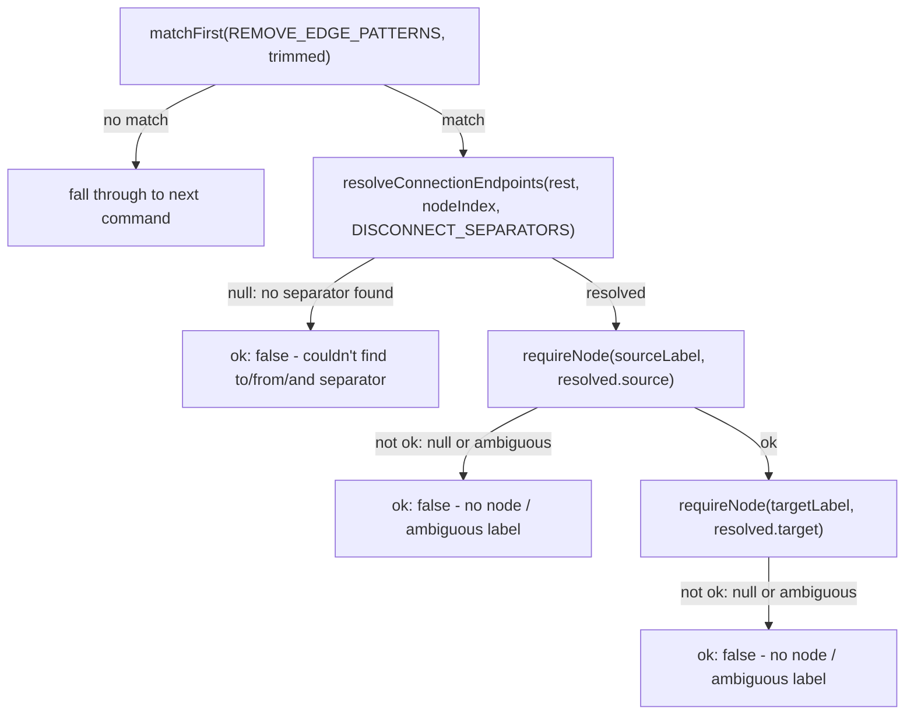
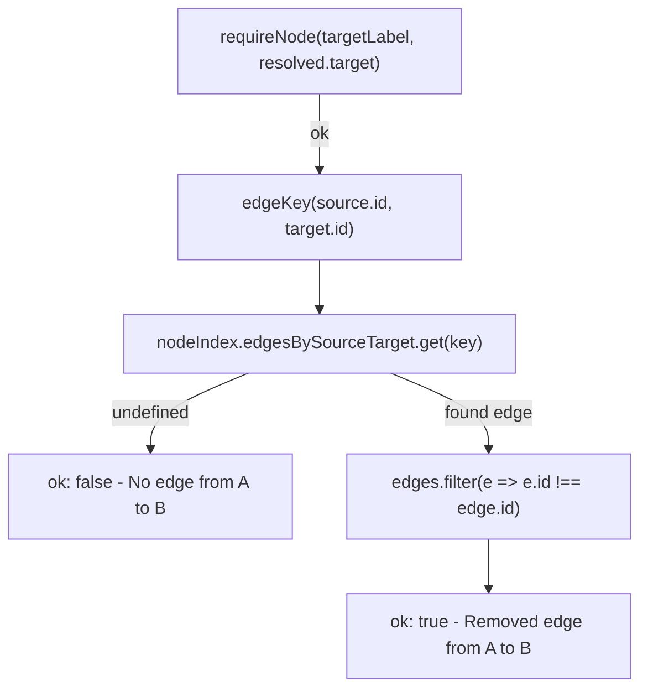

# `remove edge`

This slice matches a `remove edge <A> ... <B>` command, then splits the remainder on the `DISCONNECT_SEPARATORS` ("to"/"from"/"and") via `resolveConnectionEndpoints` to find candidate source/target labels. Each endpoint is resolved through `requireNode`, which turns a `null` or ambiguous (array) match into an error message before any mutation happens. Only once both endpoints resolve to single nodes does the code look up the edge by `edgeKey(source.id, target.id)` in `nodeIndex.edgesBySourceTarget` and, if found, filter it out of `architecture.edges` by id — leaving nodes and all other edges untouched.

**Source:** `src/lib/architecture-commands.ts:571-609`

**Command matching and endpoint validation**

**Edge lookup and removal**

The edge lookup is O(1) via the precomputed `edgesBySourceTarget` map rather than a linear scan of `architecture.edges`, but the actual removal still filters the full edges array by id — the map is used only to find the target, not to delete it.
