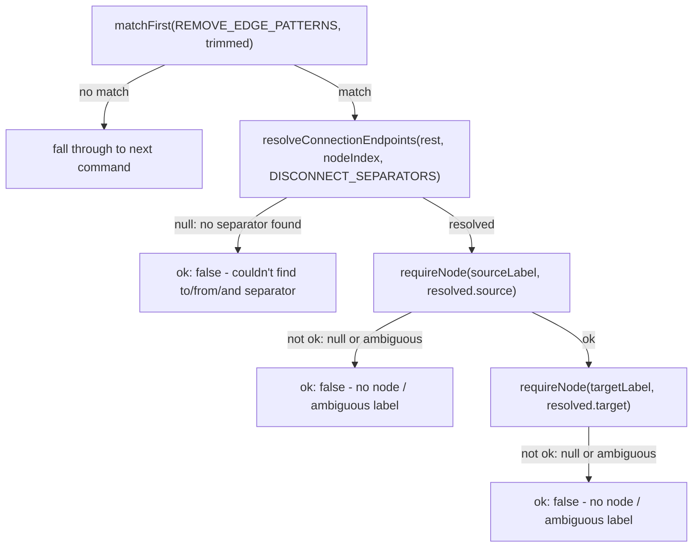
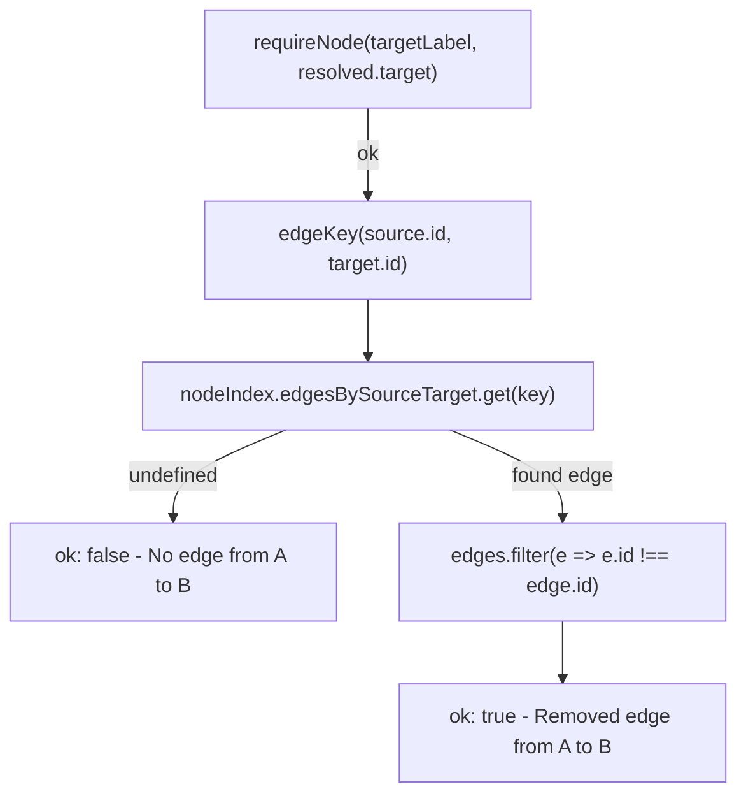

# `remove edge`

The `remove edge` command resolves each endpoint via `requireNode`, then locates the edge in O(1) through `nodeIndex.edgesBySourceTarget`, but still removes it with an O(n) `edges.filter` scan since the map isn't used for deletion.

**Source:** `src/lib/architecture-commands.ts:245-283`

**Command matching and endpoint validation**

**Edge lookup and removal**

