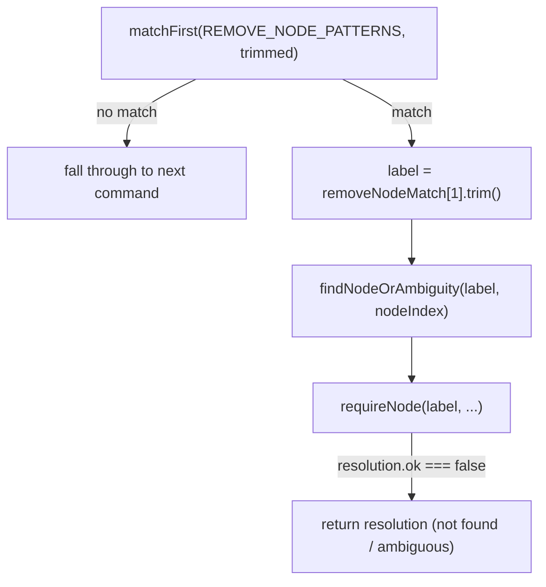
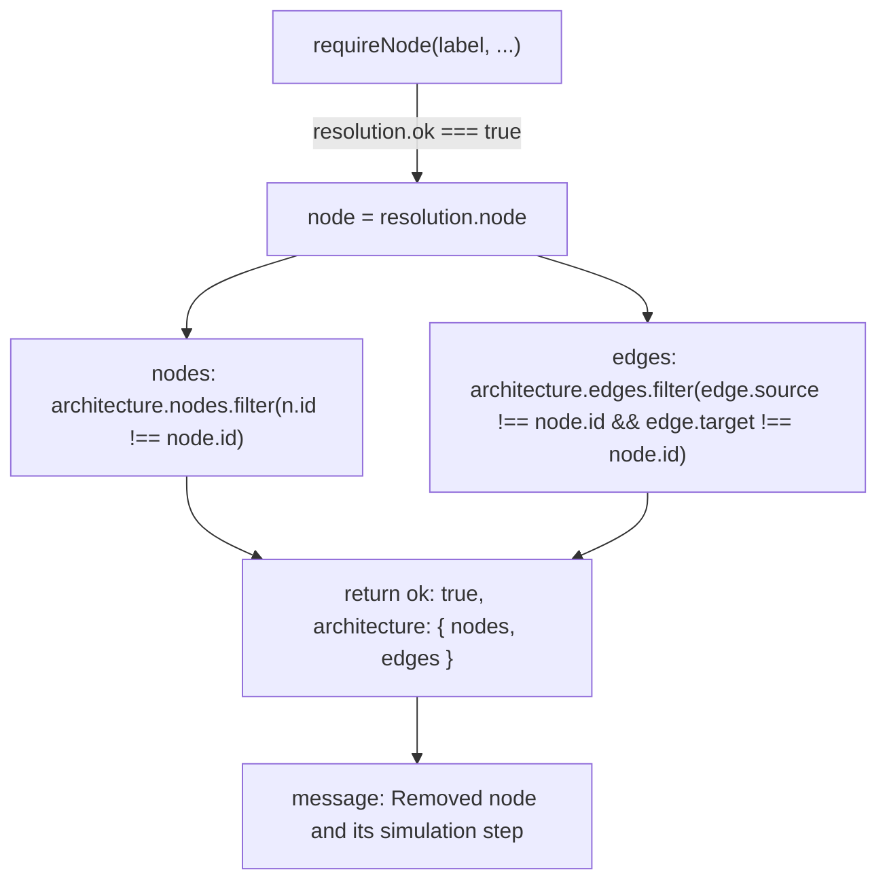

# `remove node` (cascading delete)

The `remove node <label>` command resolves the label via `findNodeOrAmbiguity`/`requireNode`, then cascades the delete in a single `edges.filter` pass that removes every inbound and outbound edge referencing the deleted node's id.

**Source:** `src/lib/architecture-commands.ts:212-233`

**Command matching and node resolution**

**Cascading edge filter and result**

