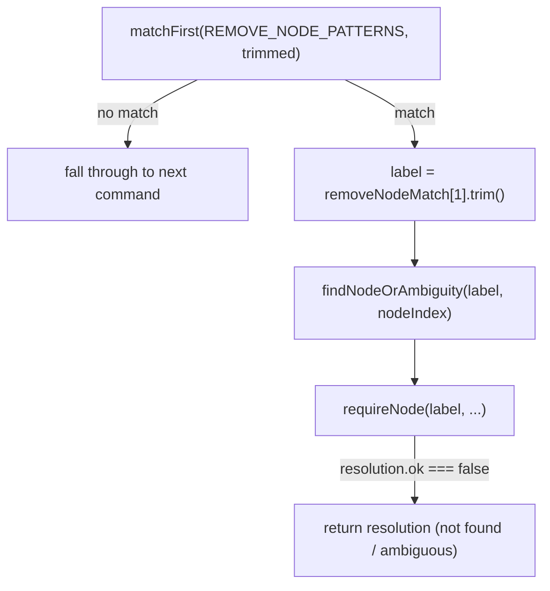
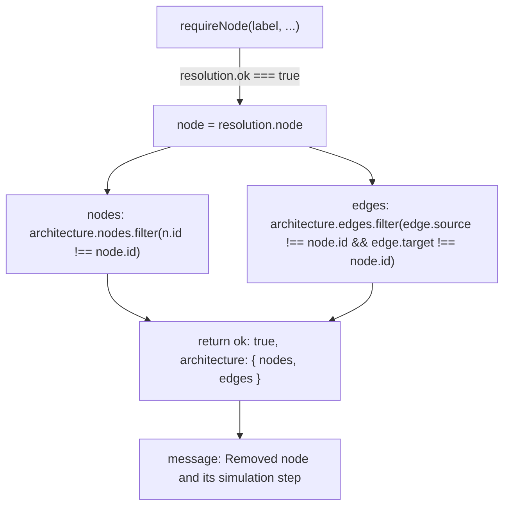

# `remove node` (cascading delete)

This slice handles the `remove node <label>` command. It matches the input against `REMOVE_NODE_PATTERNS`, resolves the label to a node via `findNodeOrAmbiguity`/`requireNode` (returning an error result if the node is missing or the label is ambiguous), and otherwise produces a new architecture with the node filtered out of `nodes` and any edge whose `source` or `target` equals that node's id filtered out of `edges`. Because edges are pruned by matching either endpoint, deleting a node cascades to remove all of its incoming and outgoing connections in one pass rather than requiring a separate "remove dangling edges" step. The success message says the node's "simulation step" was removed too, even though this code never touches a separate simulation array -- consistent with the project's pattern of embedding simulation data directly on the node rather than keeping it in a parallel structure.

**Source:** `src/lib/architecture-commands.ts:753-774`

**Command matching and node resolution**

**Cascading edge filter and result**

The edge filter's single condition (`source !== node.id && target !== node.id`) is what makes the delete cascading: one predicate removes both the node's inbound and outbound edges without a separate traversal step.
