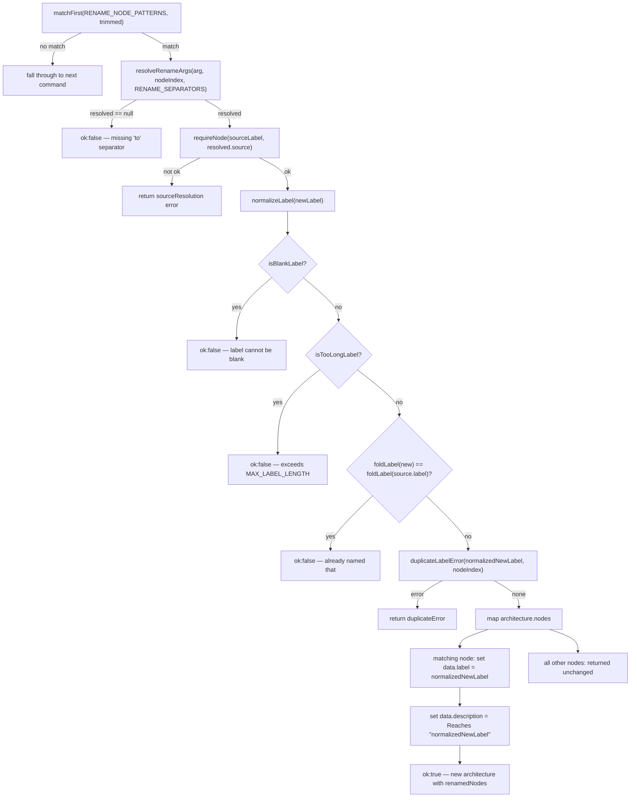

# `rename node`

The rename-node handler matches the command against `RENAME_NODE_PATTERNS`, then splits the captured argument into a source label and a new label using `resolveRenameArgs` with `RENAME_SEPARATORS`. After resolving the target node, it runs the new label through the same validation and normalization pipeline as other commands (`normalizeLabel`, blank/length checks, a `foldLabel` case-insensitive self-rename guard, and `duplicateLabelError`) before applying the change. On success it does not just swap `label` on the matching node -- it also rewrites that node's `description` to `Reaches "<newLabel>"`, so the node's embedded description stays consistent with its new name rather than becoming stale text pointing at the old label.

**Source:** `src/lib/architecture-commands.ts:610-666`

The diagram makes visible that the `description` rewrite happens only on the renamed node and is unconditional on success -- there is no check for whether the old description already referenced the old label, so a node whose description said something unrelated to "reaches" is silently replaced too.
