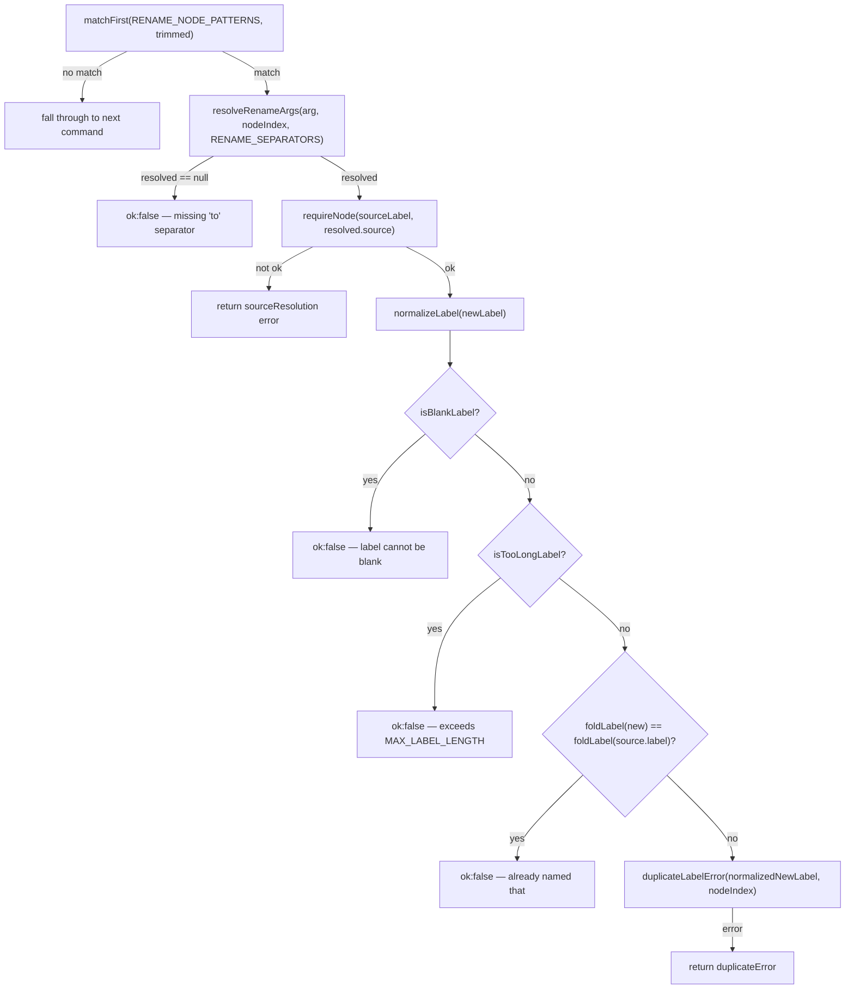
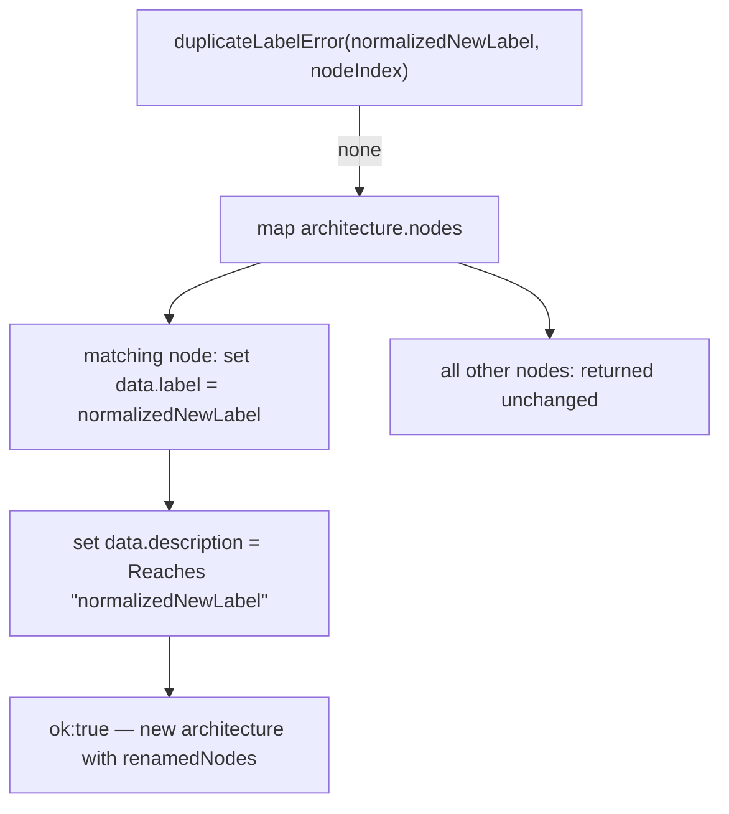

# `rename node`

The `rename node` handler validates the new label via `normalizeLabel` and `duplicateLabelError`, then on success unconditionally overwrites the renamed node's `description` to `Reaches "<newLabel>"`, regardless of what the prior description said.

**Source:** `src/lib/architecture-commands.ts:284-340`

**Matching and label validation**

**Node rewrite and result**

