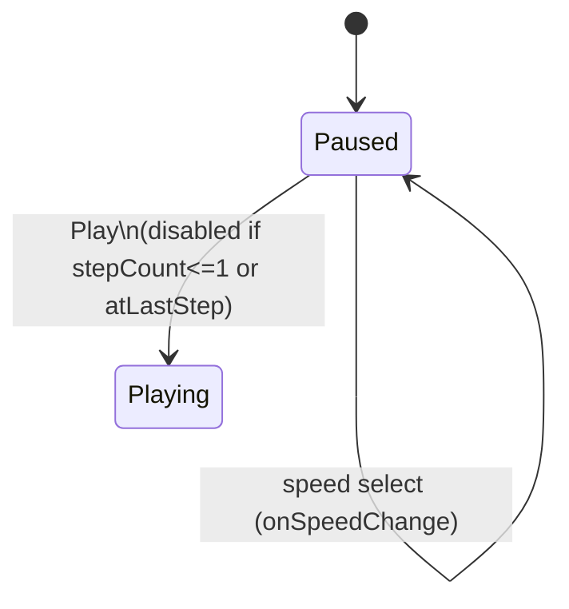
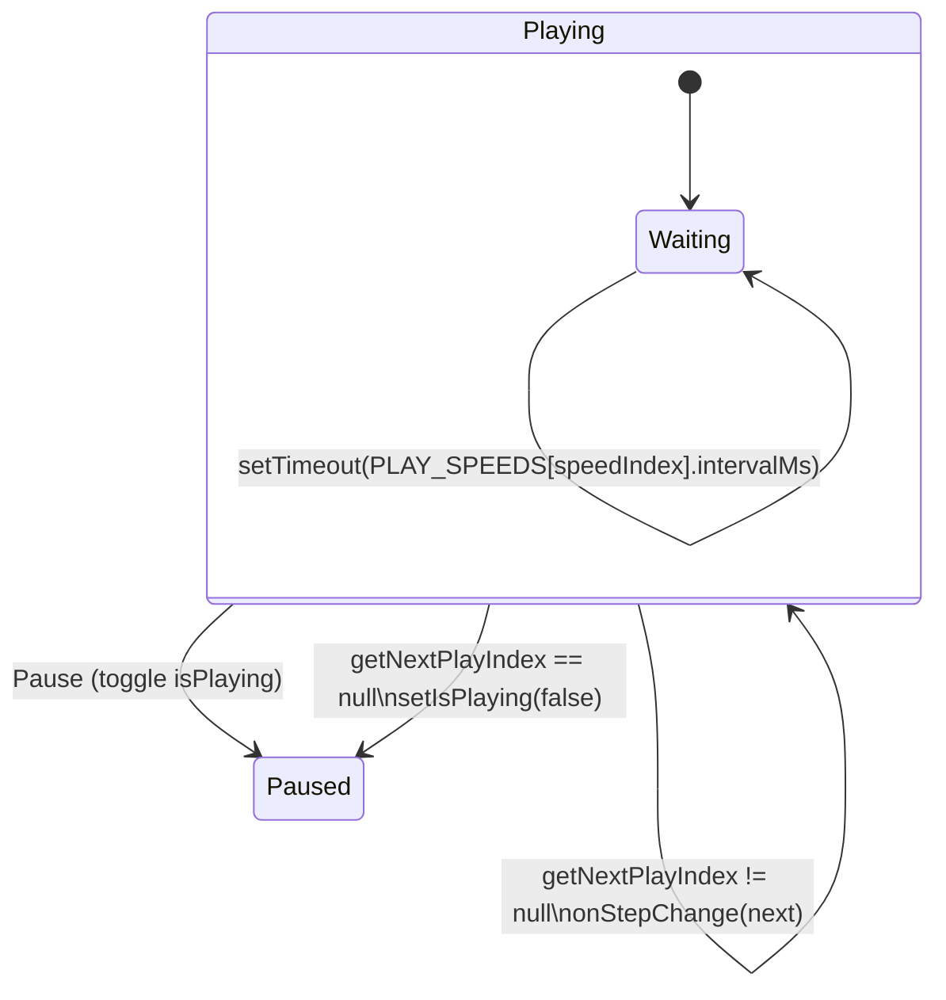

# Panel (Prev/Next/Play/Pause)

`SimulationPanel` drives `currentStepIndex` via Prev/Next and a Play/Pause toggle backed by a recursive `setTimeout` (not `setInterval`) inside a `useEffect` keyed on `isPlaying`, so each tick re-reads the latest step and speed.

**Source:** `src/components/simulation-panel.tsx:1-146`

**Paused controls and entering play**

**Playback loop and stopping**

