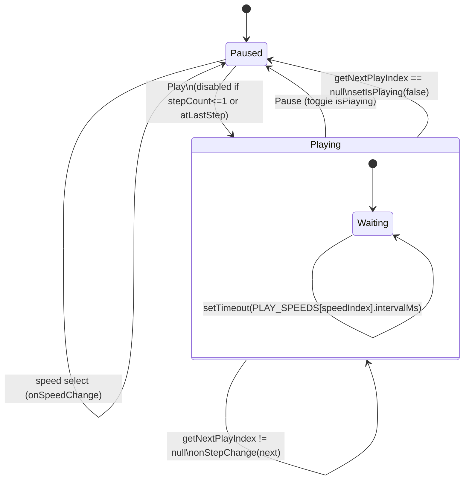

# Panel (Prev/Next/Play/Pause)

`SimulationPanel` drives the current step index with Prev/Next buttons and a Play/Pause toggle, plus a speed `<select>`. Playback is a recursive `setTimeout` inside a `useEffect` keyed on `isPlaying` (not `setInterval`), so each tick re-reads the latest `currentStepIndex`/`speedIndex` and cleans up via the returned `clearTimeout` — this avoids the stale-closure drift a bare `setInterval` would have once step/speed change mid-playback. `getNextPlayIndex` returns `null` at the last node, which the effect uses to auto-stop (`setIsPlaying(false)`) rather than looping. The Play button itself is disabled with `stepCount <= 1 || (!isPlaying && atLastStep)`, preventing a restart from the final step without first pressing Prev.

**Source:** `src/components/simulation-panel.tsx:1-129`

The disabled condition on Play (`!isPlaying && atLastStep`) is the subtle bit the diagram surfaces: the timer's own null-check stops playback at the end, but the button guard is what stops the user from immediately re-triggering it from that same terminal state.
