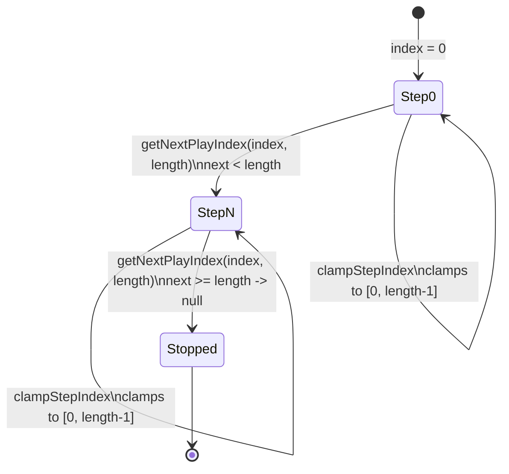
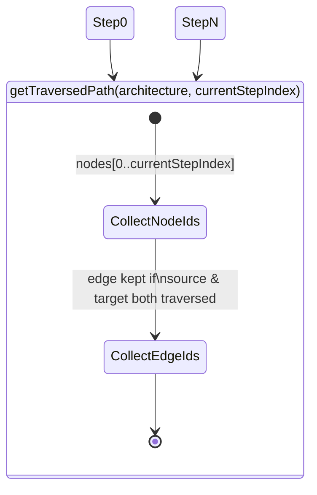

# Stepper (trace = node array order)

`getTraversedPath` highlights an edge only once both its `source` and `target` ids appear in the traversed-node `Set` built from `nodes[0..currentStepIndex]`, so a fan-out or fan-in edge stays dark until the trace reaches its far endpoint.

**Source:** `src/lib/simulation.ts:14-69`

**Step advancement and clamping**

**Traversed-path computation**

