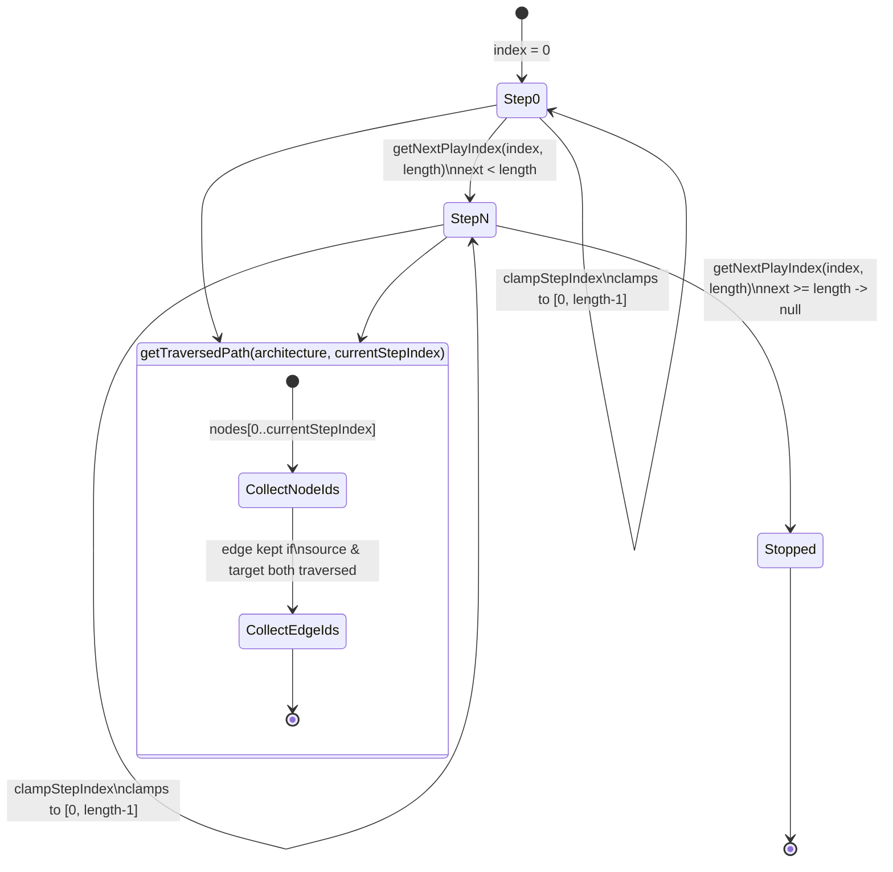

# Stepper (trace = node array order)

The simulation has no separate trace data structure: the "trace" is simply `architecture.nodes` in array order, and the current step is an index into that array. `clampStepIndex` keeps an index within `[0, length - 1]` (or `0` for an empty list) so external state can never point past the ends of the array. `getNextPlayIndex` advances by one and returns `null` once `index + 1` would reach or pass `length`, which is what stops autoplay at the last node. `getTraversedPath` walks nodes `0..currentStepIndex`, collects their ids into a `Set`, then adds any edge whose `source` and `target` are both in that set -- giving the "attacker has already crossed" highlight path. `stepDescription` reads `node.data.description`, falling back to a generated `Reaches "<label>".` string for nodes persisted before descriptions existed on node data.

**Source:** `src/lib/simulation.ts:12-51`

The two-set edge filter is the subtle part: an edge only lights up once *both* endpoints have been stepped through, so a fan-out or fan-in edge stays dark until the trace actually reaches its far side, not just its near side.
