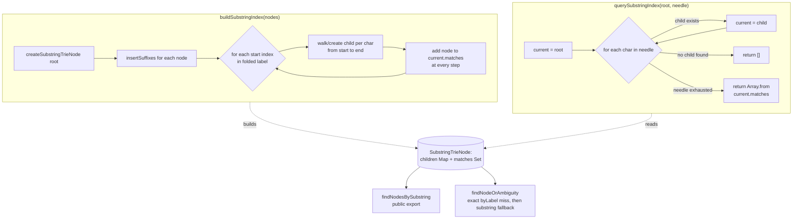

# Suffix trie substring index

`NodeIndex` maintains a trie built from every suffix of every node's folded label (`foldLabel`: NFC-normalize + lowercase). `insertSuffixes` walks each starting position of a label's characters, creating a child per character and recording the owning `ArchitectureNode` in that child's `matches` set, so any prefix-of-a-suffix (i.e. any substring) of the label is reachable as a trie path. `querySubstringIndex` then answers "which nodes contain this substring" in O(needle length) by walking the trie by the needle's characters and returning the `matches` set at the final node. This lets `findNodeOrAmbiguity` fall back from an exact-label lookup to a substring search - and report ambiguity - without scanning every node's label on each command.

**Source:** `src/lib/architecture-commands.ts:84-199`

Because every suffix is inserted separately, a single label of length n contributes O(n^2) trie edges but makes every one of its substrings a valid query path - the same trie node ends up in the `matches` set of every node whose label contains that substring, which is what lets `findNodeOrAmbiguity` detect and report multi-node ambiguity in one lookup.
