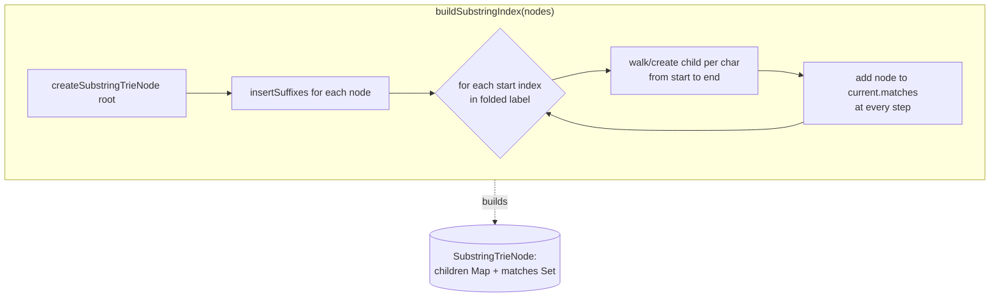
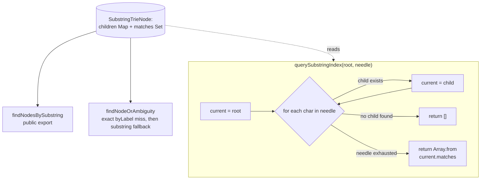

# Suffix trie substring index

`NodeIndex` builds a trie from every suffix of each node's folded label via `insertSuffixes`, so every substring becomes a valid trie path whose terminal `matches` set collects every node containing it.

**Source:** `src/lib/node-index.ts:25-140`, `src/lib/command-resolution.ts:61-73`

**Building the trie**

**Querying and consuming the index**

