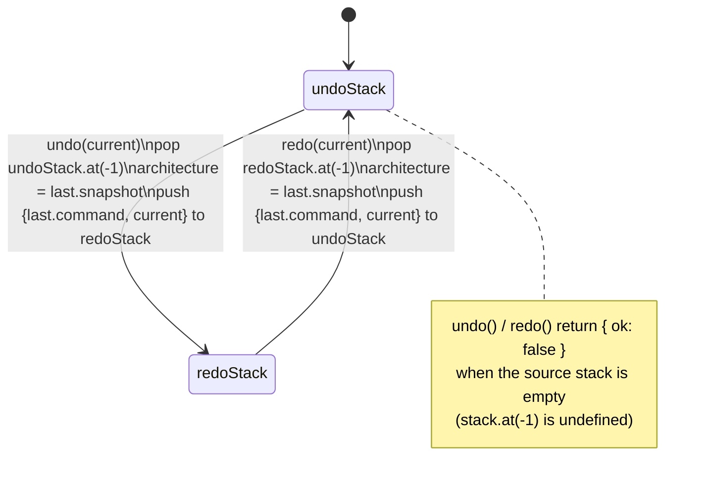

# Undo/redo (two-stack model)

Undo/redo is implemented as two stacks of `HistoryEntry` (`command` text plus a full `Architecture` snapshot) inside a plain `UndoRedoState` object, with no classes or mutation. `recordCommand` is called after a command changes the architecture: it pushes the pre-command snapshot onto `undoStack` and resets `redoStack` to `[]`, since a fresh command invalidates whatever redo branch existed. `undo` and `redo` are mirror images of each other: each pops the most recent entry off its source stack, returns its snapshot as the architecture to restore, and pushes the *current* (pre-undo/redo) architecture onto the other stack so the action can be reversed again. Both use `.at(-1)` to peek the top and return `{ ok: false }` instead of throwing when the source stack is empty; `undoStack` is also capped at `MAX_UNDO_HISTORY_ENTRIES` (500) via a trailing `slice`, dropping the oldest entries since every entry carries a full architecture snapshot.

**Source:** `src/lib/undo-history.ts:26-138`

**Primary undo/redo cycle**

**recordCommand resetting the redo branch**

```mermaid
stateDiagram-v2
    state "undoStack" as Undo
    state "redoStack" as Redo

    [*] --> Undo

    Undo --> Undo: recordCommand(cmd, before)\npush {cmd, before}; redoStack = []

    Redo --> Undo: recordCommand(cmd, before)\npush {cmd, before}; redoStack = []
```

The subtle part the diagram makes visible: `recordCommand` can fire from either state (`Undo` or `Redo`) and both times it clears `redoStack`, which is why redoing is only ever possible immediately after an undo, not after any new edit.
