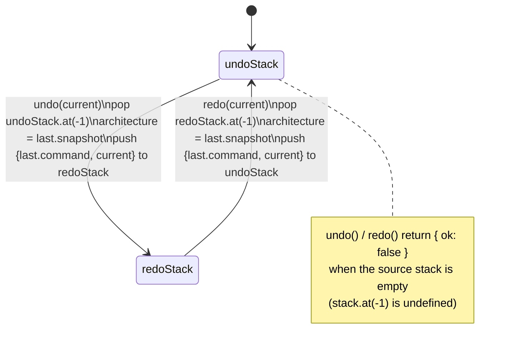

# Undo/redo (two-stack model)

`recordCommand` resets `redoStack` to `[]` on every new command regardless of whether it fires from the undo or redo side, which is why redoing is only possible immediately after an undo, never after a subsequent edit.

**Source:** `src/lib/undo-history.ts:26-138`

**Primary undo/redo cycle**

**recordCommand resetting the redo branch**

```mermaid
stateDiagram-v2
    state "undoStack" as Undo
    state "redoStack" as Redo

    [*] --> Undo

    Undo --> Undo: recordCommand(cmd, before)\npush {cmd, before}; redoStack = []

    Redo --> Undo: recordCommand(cmd, before)\npush {cmd, before}; redoStack = []
```

